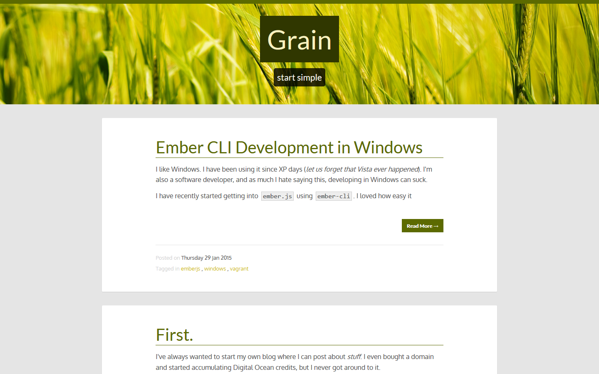

# barley
>  A Ghost theme derived from [GhostLook's Magnum](http://magnum.ghostlook.com/) theme.

This theme is a fork of the Magnum theme, there were some changes made that make it a bit easier to hack on. A lot of the unused files were removed and there code was in general cleaned up a bit.

This fork will probably not merge upstream.

## Features
- Tested with Ghost 0.5.7.
- Out of the box support for Disqus and Google Analytics.
- Custom Favicon.
- Code highlighting using [Google's Code Prettify](https://code.google.com/p/google-code-prettify/).
- Developer friendly, highly customizable if you can write code.

## Demo
Here's [demo](http://blog.jvtrigueros.com/).

## Installation
Download [theme](https://github.com/jvtrigueros/barley/releases/latest) and extract into in your `<Ghost directory>/content/themes`.

### Disqus
To configure Disqus edit `barley/partials/disqus.hbs`.

### Google Analytics
To configure Google Analytics edit `barley/partials/google-analytics.hbs`.

## Build
If you want to build it from source, clone the project

    git clone https://github.com/jvtrigueros/barley.git
    cd barley

Install build and frontend dependencies

    npm install

Build asset pipeline

    npm install -g gulp
    gulp
    # OR if you don't want to install gulp globally
    ./node_modules/.bin/gulp

This will minify all javascript and compile all the less files into css then minify it as well.

All preprocessed assets are in `src/`, if you'll be working on these files a lot, I'd recommend running `gulp watch`. This will watch all the preprocessed assets as you change them. 

## Attributions
Not all of the content here is my own, so I'd like to attribute people for their work.

### Stock Photography

- [Nell Williamson](https://www.flickr.com/photos/neillwphoto/) - [The Wheat Field](https://www.flickr.com/photos/neillwphoto/14579916743/in/photostream/)
    - No changes were made, used as is.

### Theme

- [Magnum](https://github.com/fredomhu/magnum) - [fredomhu](https://github.com/fredomhu) fork
    - Original from [durgesh-priyaranjan](https://github.com/durgesh-priyaranjan)

### Icons

- [Cliparts.co](http://cliparts.co) - [Wheat Icon](http://cliparts.co/clipart/2598857)
    - Changed the colour and cropped it.

### Issues and Feature Requests
Please submit a Github issue.
