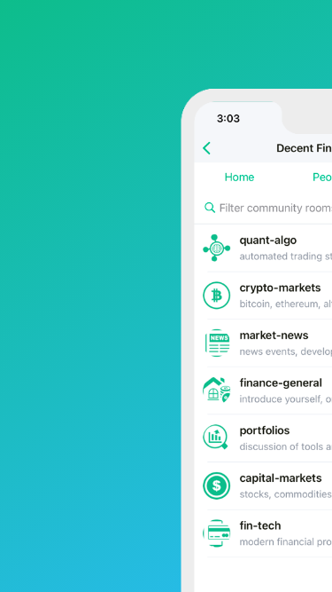

<!-- @format -->

## Work Summary

- Problem:

  - In 2020, the only way to stay in touch with friends was through remote cloud-hosted platforms.

- Challenges:

  - How do we keep an interactive, interoperable environment that can compete with Slack and Discord, without giving up our private information and conversation history?
  - How do this in a way that is fully encrypted and fully owned by us?
  - What platform will help us federate our conversations with people with similar interests?

- Deliverable:

  - http://DecentFinance.club
    - A Matrix-synapse based chat server and decentralized chat client, privately hosted and secured by a team of decentralized tech and privacy-focused experts.

## Work Interests

I have been interested in financial markets since I first started talking to hedge fund employees and their IT departments.

> I lived in Laramie, Wyoming with a few friends; the goal was to go to college at the University of Wyoming, but I took on just a small grant from the government to attend the community college.

> After too long to decide between psychology, computer science, and English, I eventually dropped out of college, paid back the grant, and went to work full-time at [Falcon Trading computers](https://www.tradingcomputers.com/). It was an exciting opportunity where I was to be their first tech support and customer representative.

> The mission of Falcon was pretty straightforward: offer consumer grade, cutting edge multi-monitor workstations by unlocking and optimizing the processing and memory capabilities of PCs (circa 2008). We heavily marketed their computers towards retail day traders, owning several domains like [tradingcomputers.com](https://www.tradingcomputers.com).

> It was an exciting time to be learning about how to optimize these power-house workstations. But it was also a volatile and historic time. I had a front-row seat as all the bells and whistles went off each day through those cold September and October candles during the stock market crash of 2008.

> We pushed our computers to the ultimate max they could go, and like many banks of that era, a few of our computers didn’t survive. This was an extremely busy and time in my life. But through the cloud of shredded hard drives, blown capacitors, and stray electrons, I could take first hand lessons from day traders of all disciplines. Some customers included funds running our setups on the upstairs floors of prominent banks that no longer exist.

> Little did we know how short those computers were going to operate. But the connections and lessons I learned during this period set the bedrock for my career for years to come.
