# Contact

Hey, thanks for stopping by my little nook.

I enjoy writing about and developing things that help people make their daily lives a little easier. So if there's anything you think I can help with, then please [get in touch](#get-in-touch) or [schedule a call](#schedule-a-call).

And while you're here, if there's I've written that makes you want to do better work, please consider [leaving a donation](#donate).

## Something I can help with?{class="big"}

### Get in touch

Send me an email, text, or leave a voicemail.

**Phone** [+1 ‪ (646) 694-2062](tel:+16466942062)

**Email** [mscotthendricks@gmail.com](mailto:mscotthendricks@gmail.com)

**Location** [Seattle WA (98125)](https://www.google.com/maps/place/Seattle,+WA+98125)

### Send me a note

Project in mind? Or need some help with documentation? Want to share your thoughts about an article I wrote? Reach out using your name, email, and a brief message (or [schedule a call](#schedule-a-call) instead.)

<form name="contact" method="post" v-on:submit.prevent="handleSubmit" action="/success/" data-netlify="true" data-netlify-honeypot="bot-field">
  <input type="hidden" name="form-name" value="contact" />
  

    <label>
      Don’t fill this out: <input name="bot-field" />
    </label>
  

  

    

      <label for="name" class="form-input-label">Your name</label>
      <input class="form-input" required type="text" name="name" v-model="formData.name" />
      
    

    

      <label class="form-input-label" for="email">Your email</label>
      <input class="form-input" required type="email" name="email" v-model="formData.email" />
      
    

  

  

    <label class="form-input-label" for="message">Message</label>
    <textarea required class="form-input" name="message" v-model="formData.message"></textarea>
    
  

  <a class="link-button" href="#">
    <button type="submit">Submit form</button>
  </a>
</form>

## Donate

Like my work? Please consider making a small cryptocurrency donation in support of my work in advocacy of mental health.

- **BTC** `bc1qxh43fxj0nelgrzdarw20xqupe40uu9n87elkef`
- **LTC** `ltc1qgw0qtx98r46s8ztmvgdlex7z9652gnazuns7f2`
- **ETH** `0x4CCA834388a145955854Dc38a9D349A8298032a1`

### Or buy me a coffee

<a class="link-button" href="https://www.buymeacoff.ee/mscotthendricks">
<button class="">Buy me a coffee </button>
</a>

Like many, Covid-19 has disrupted our daily lives and resources.That's why 4% of all my buymeacoffee.com earnings go to The Child Mind Institute's [COVID-19 RESPONSE](https://childmind.org/coping-during-covid-19-resources-for-parents/) towards helping families get the resources and support they need during this uncertain time - match me by visiting [https://childmind.org/donate/](https://childmind.org/donate/)

---

#### Corona Virus: Parents Resource

> "With schools closed and children at home, anxiety is running high. We know parents are struggling to balance work, child care, self care all while keeping worries — both your children’s and you own — under control. You don’t have to do it alone. We’ve put together resources to help you stay safe, sane, and supported during this troubling time." — **[Child Mind Institute (childmind.org)](https://childmind.org/donate)**

<iframe src="https://www.youtube.com/embed/aYlXLMaFzgU"  allowfullscreen></iframe>

---
