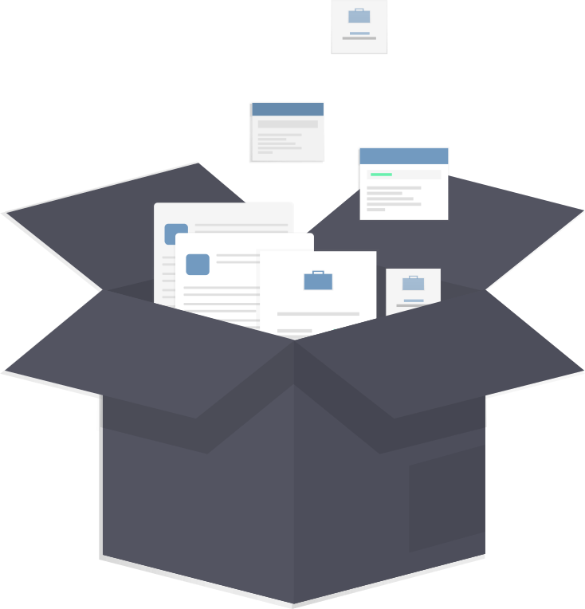
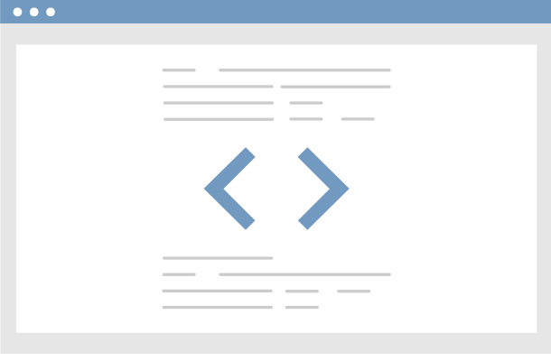

# Freelance Services and Technical Solutions

You need someone who understands the plan and the deliverable. Getting a comprehensive view of specialized work and cutting down useless processes is what I like to do best.

What I do almost every day (and what I can help you with doing):

1. [Technical Writing](/services/documentation) for internal and external audiences.
2. [Product and Project Management](/services/management) for software projects.
3. [Technical Solutions](/services/web) for the web.

As a disciplined technical writer, my core strength is in understanding how to use the entire team to manage subject-matter time efficiently. As a versatile product manager, I keep a bird's-eye view on all priorities that keep me transparent and flexible to make changes when needed.

_Follow the science_ - I’m ready to work with you using an empirical and development-focused mindset. Following evidence and research has taught me remarkable ways to build on human strengths that can be applied to work successfully on your project.

## I can help with

- Hands-on development using popular Content Management Systems
- Process discovery and documentation
- Static website generation and building processes
- Technical Project Management and writing
- And much more

Let's work together on something you enjoy.

<a class="link-button" href="/contact#get-in-touch"> <button>Get in touch</button></a>

## **Technical Services**

### **Communication and Content Services**{class="big"}

I specialize in delivering technical resources for both internal and external audiences.

[{class="medium"}](/services/documentation)

- **CMS Maintenance and Management**
- **Help desk optimization and Process improvement**
- **Technical Documentation and User guides**

<a class="link-button" href="/services/documentation"> <button>Read more</button></a>

### **Client and Project Management**{class="big"}

Be it a physical a software application or a service you deliver, let me get your project off the ground or give you the extra push you need for it to become successful.

[{class="medium"}](/services/management)

I can work with you you on your approach, feature prioritizations, or even talk to your customers to help you define your needs and provide insight to help you complete features for your project.

Since I'm also a technical writer, I'll make sure we've properly documented your solutions, and your decisions.

<a class="link-button" href="/services/management"> <button>Read more</button></a>

---

My preferred method of tracking productivity and planning is through [Notion.so](http://notion.so/).

[{class="large"}](/services/notion)

<a class="link-button" href="/services/notion"> <button>Learn about Notion.so</button></a>

But I'm also experienced and skilled with most popular collaboration services:

[{class="medium"}](services)

- **Atlassian Suite (JIRA, Confluence, Trello)**
- **Office 365 and Azure**
- **G Suite for Business**

<a class="link-button" href="/services/management"> <button>Read more</button></a>

### **Solutions for Web and Mobile**{class="big"}

I'm a hands-on product manager who knows and uses code every day. I've figured out ways to work on systems that help develop easy-to-understand solutions.

[{class="medium"}](/services/web)

- **Help Desk and eCommerce Services for Small Businesses**
- **Website builder and hosting consultation (Squarespace, Wix, Shopify, Ghost, Netlify)**
- **Custom JAMStack Development (JavaScript, APIs, Markdown)**

<a class="link-button" href="/services/web"><button>Read more</button></a>

## **Deliverables**

- **Documentation**
  - API documentation for developers
  - Content for Chatbots
  - Online Help Articles
  - Software User Guides
  - Standard Operating Procedures
- **PM Activities**
  - Customer Success and User Stories
  - Product Requirements Documents
  - Client feedback prioritization
- **Resources for the web**
  - Content Management and Customer Relationship Services support
  - Database and Markdown migrations
  - Managed and Static website generation
  - Web Host and CDNs optimizations

## **Questions**

### **How can you help me with my website?**

I specialize in website integrations and project-related planning, support, and documentation.

### **What is JAMStack?**

JAMStack stands for JavaScript, APIs, and Markdown and is a fresh approach for building websites. I have found this method useful since it makes it easy to update content.

### **Do you use XYZ framework?**

If you're looking for a technical document and support, I'd love to help! Shoot me an email and we can talk about your requirements.

As far as web solutions, I stay away from large frameworks and like to build lightweight websites that anyone can use and update.

### **What do you charge?**

Let's say, roughly `$50` an hour? But I prefer to charge based on project and milestone. We can talk this out.
