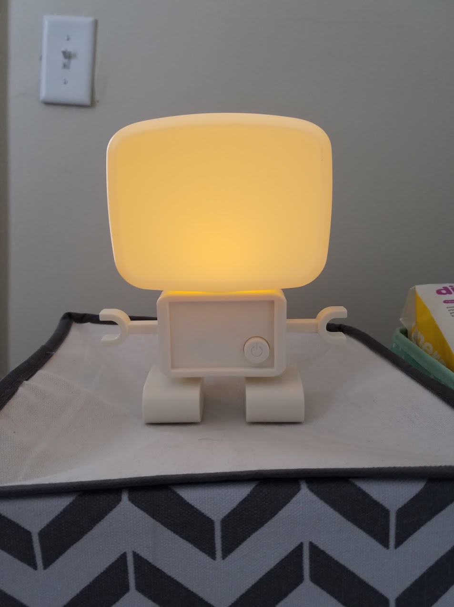
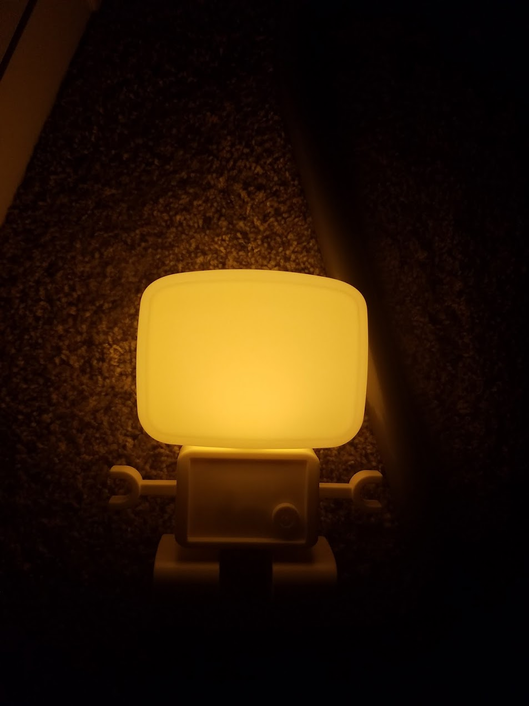

<iframe height="265" style="width: 100%;" scrolling="no" title="Arthur's Nightlight" src="https://codepen.io/watthem/embed/RoZjPy?height=265&theme-id=dark&default-tab=result" frameborder="no" allowtransparency="true" allowfullscreen="true">
  See the Pen <a href='https://codepen.io/watthem/pen/RoZjPy'>Arthur's Nightlight</a> by Matthew Hendricks
  (<a href='https://codepen.io/watthem'>@watthem</a>) on <a href='https://codepen.io'>CodePen</a>.
</iframe>

